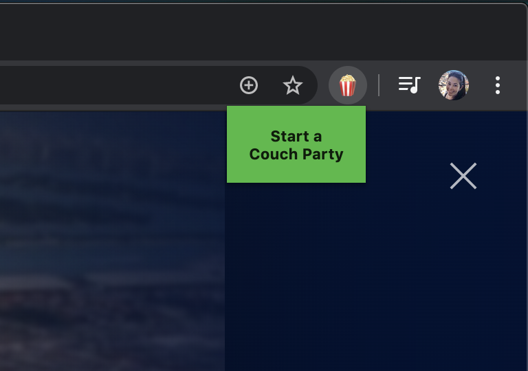
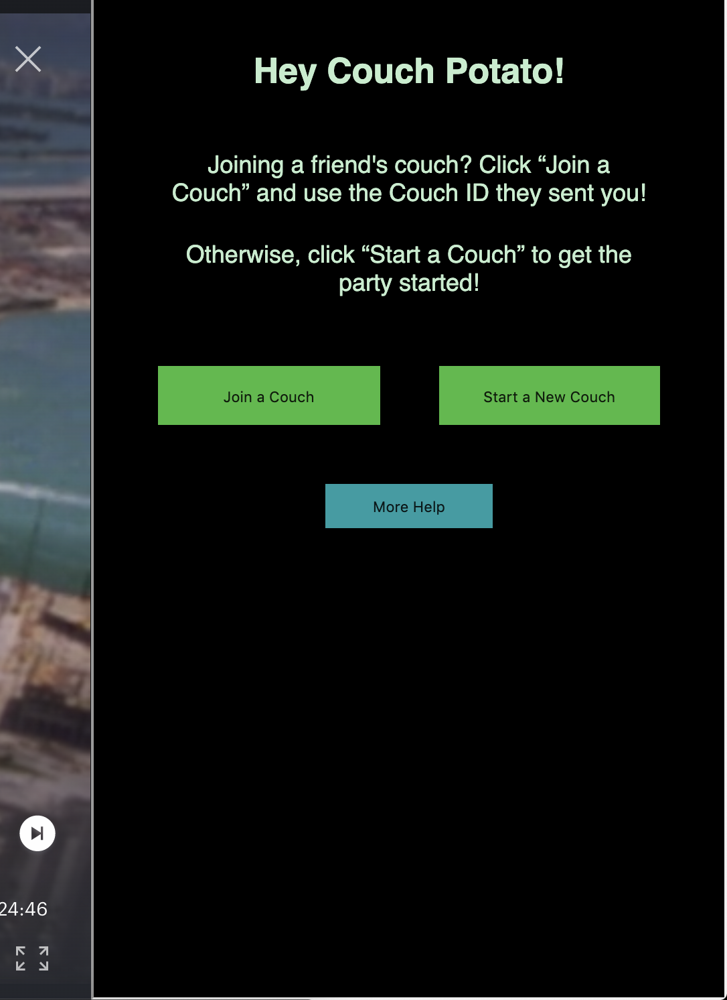

# Couch Potato

Couch Potato is a Chrome extension allowing Hulu users to watch shows together from the comfort of their own couch.

Our extension uses React, Express, and Socket.io to create private chat rooms, which are then loaded into the Hulu frame via our extension. Once launched, users can control play/pause functionality across all users’ screens in order to create a shared viewing experience. We also take advantage of React libraries to enable emojis and a popup to edit user information in the chat window.

## Using the Extension

Once you and your friends have installed the Couch Potato extension, begin watching a show or movie on Hulu, then click on the popcorn icon in your Chrome menu bar and then the "Start a Couch Party" button that pops up.



To start a Couch, click "Start a New Couch," enter your name, and click "Start." If your friend has already started a Couch, click "Join a Couch," and enter the Couch ID they gave you along with your name, and click "Join."



You're now on the Couch! Look at the top of the chat to see who else is here, or click on the green Couch ID to copy and share the 15-digit number with your friends. Now, get to binge-watching!


## Getting Started

In order to test this program on a local machine, you will have to update references to 'couch-potato-extension.herokuapp.com' with your local host (e.g. 'http://localhost:3000').

```
npm install
npm run start-dev
```

For convenience, we have included a `comments` branch which includes explanations of our code.

```
git checkout comments
```

## Built With

- [Chrome Extensions](https://developer.chrome.com/extensions/getstarted) - The architecture used
- [Socket.io](https://socket.io/get-started/chat) - Real-time chat features
- [React.js](https://reactjs.org/) - Building user interface

## Acknowledgments

### Advisors

- [David Patlut](https://github.com/dpatlut)
- [Sarah Zhao](https://github.com/sarahzhao25)

### Tutorials Referenced

- **Integrating Socket.io into a Chrome Extension:** [video](https://www.youtube.com/watch?v=1zVoGTQUXvs) and [corresponding repo](https://github.com/matthewlawson/lnm-socket.io)
- **Build Real Time Chat Rooms With Node.js And Socket.io:** [video](https://www.youtube.com/watch?v=UymGJnv-WsE) and [corresponding repo](https://github.com/WebDevSimplified/Realtime-Chat-App-With-Rooms)

## License

This project is licensed under the MIT License - see the [LICENSE.md](LICENSE.md) file for details

## Authors

- [**Dani Meyer**](https://github.com/dlm19)
- [**Eunjoon Hwang**](https://github.com/joonybejoy)
- [**Grace Murray**](https://github.com/gkmurray124)
- [**Caitlin Floyd**](https://github.com/cafloyd)
